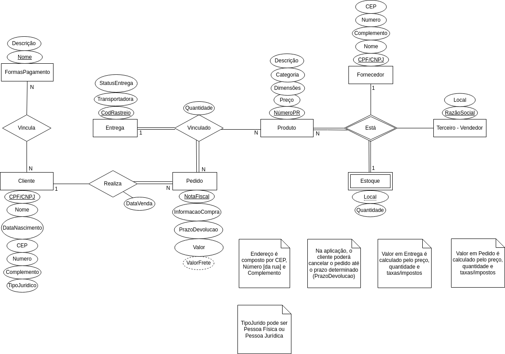

# Desafio de E-commerce - Bootcamp Suzano - Análise de Dados com Power BI

Este arquivo contém a solução para o desafio do Bootcamp relacionado a um sistema de vendas de produtos em um e-commerce. O objetivo do desafio é modelar e implementar a interação entre diversas entidades, como **Produto**, **Estoque**, **Fornecedor**, **Pedido**, **Venda de Cliente** e **Cliente**, para criar um sistema funcional de comércio eletrônico.

## Descrição do Desafio

### Produto
- Os produtos são vendidos em uma única plataforma online, porém, esses produtos podem ter vendedores distintos (terceiros).
- Cada produto tem um fornecedor.
- Um ou mais produtos podem ser associados a um pedido realizado por um cliente.

### Cliente
- O cliente pode se cadastrar no sistema utilizando seu CPF ou CNPJ.
- O endereço de entrega do cliente influencia no cálculo do valor do frete.
- O cliente pode realizar múltiplos pedidos, e cada pedido possui um período de carência para devolução do produto.

### Pedido
- O pedido é criado por um cliente e contém informações sobre a compra, o endereço de entrega e o status da entrega.
- Um pedido pode incluir um ou mais produtos.
- O pedido pode ser cancelado a qualquer momento, dependendo das condições.

### Fornecedor & Estoque
- O estoque controla a quantidade disponível de cada produto para venda.

## Modelo Conceitual

O modelo conceitual descreve a estrutura lógica das entidades e como elas interagem no contexto do sistema de e-commerce. Esse modelo foi projetado para garantir uma gestão eficiente de vendas, estoque, fornecedores e clientes.

